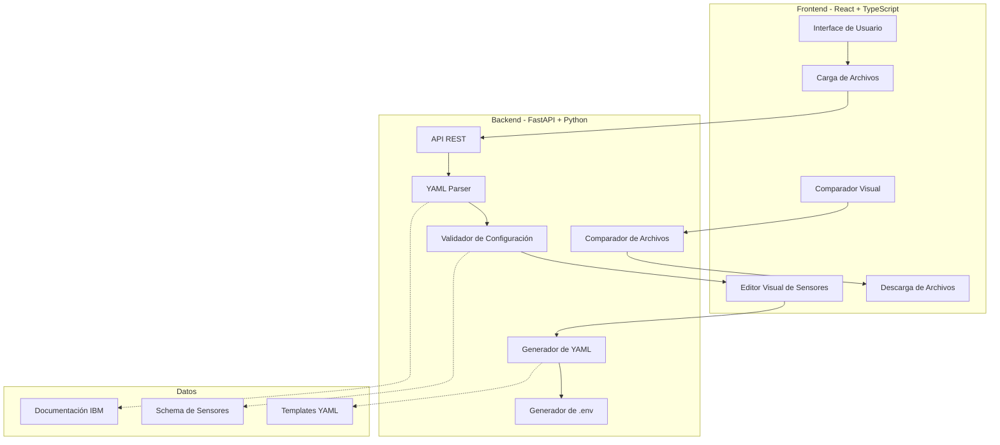
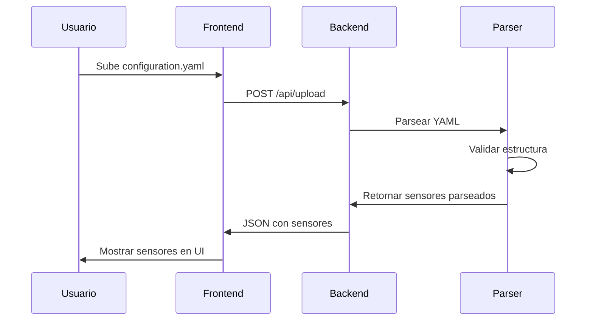
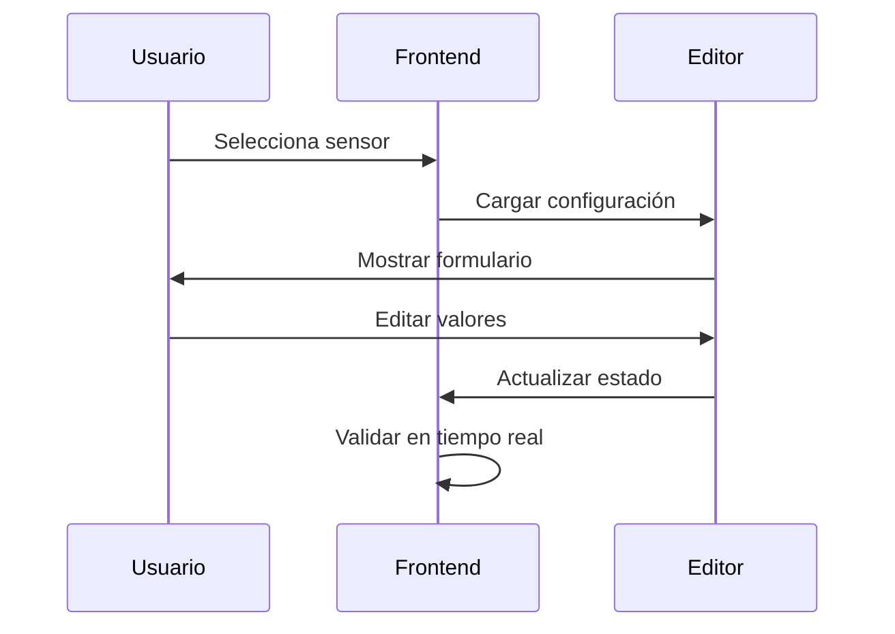
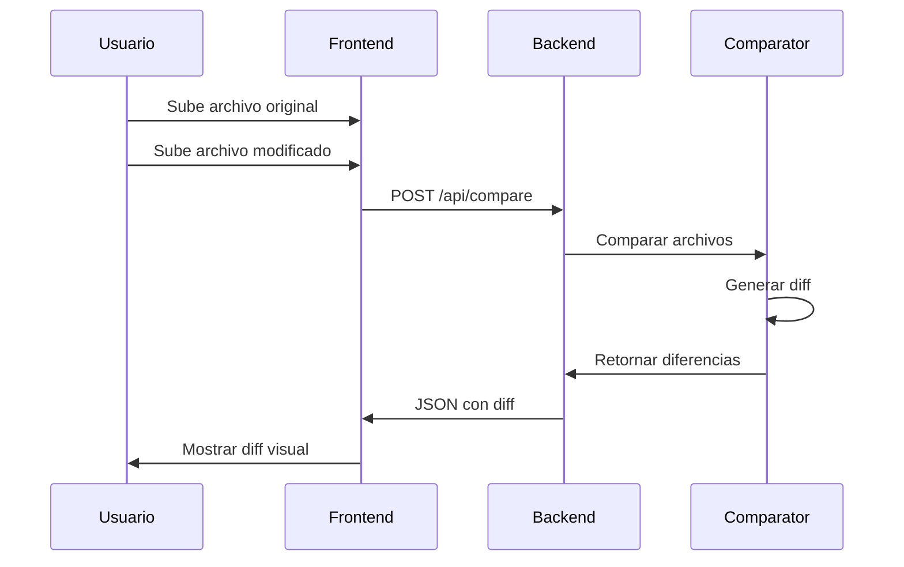
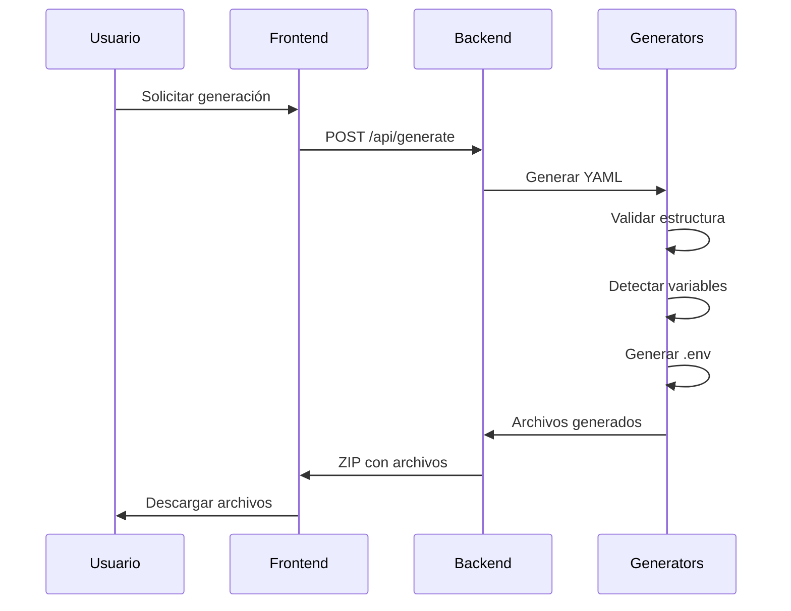

# Instana Config Pilot - Arquitectura del Sistema

## 📋 Resumen del Proyecto

**Instana Config Pilot** es una herramienta web para facilitar la creación, comparación y validación de archivos de configuración YAML de IBM Instana. Resuelve los problemas comunes de edición manual de archivos `configuration.yaml`, como errores de sintaxis, indentación incorrecta, campos incompletos y configuraciones inconsistentes.

## 🎯 Objetivos Principales

1. **Parsear y analizar** archivos `configuration.yaml` existentes
2. **Editar configuraciones** mediante una interfaz visual intuitiva
3. **Comparar archivos** con diff visual antes de aplicar cambios
4. **Validar sintaxis** y estructura según documentación IBM
5. **Generar archivos** `.env` con variables requeridas automáticamente
6. **Descargar configuraciones** resultantes listas para usar

## 🏗️ Arquitectura General



## 📁 Estructura del Proyecto

```
instana_config_pilot/
├── frontend/                    # Aplicación React
│   ├── src/
│   │   ├── components/         # Componentes React
│   │   │   ├── FileUploader/   # Componente de carga
│   │   │   ├── SensorEditor/   # Editor de sensores
│   │   │   ├── DiffViewer/     # Visualizador de diferencias
│   │   │   └── ConfigDownloader/ # Descarga de archivos
│   │   ├── services/           # Servicios API
│   │   │   └── api.ts          # Cliente Axios
│   │   ├── types/              # Tipos TypeScript
│   │   │   └── instana.ts      # Tipos de sensores
│   │   ├── utils/              # Utilidades
│   │   ├── App.tsx             # Componente principal
│   │   └── main.tsx            # Punto de entrada
│   ├── public/
│   ├── package.json
│   ├── tsconfig.json
│   ├── vite.config.ts
│   └── tailwind.config.js
│
├── backend/                     # API FastAPI
│   ├── app/
│   │   ├── main.py             # Aplicación FastAPI
│   │   ├── models/             # Modelos Pydantic
│   │   │   ├── sensor.py       # Modelo de sensor
│   │   │   └── config.py       # Modelo de configuración
│   │   ├── services/           # Lógica de negocio
│   │   │   ├── parser.py       # Parser YAML
│   │   │   ├── validator.py    # Validador
│   │   │   ├── comparator.py   # Comparador
│   │   │   ├── env_generator.py # Generador .env
│   │   │   └── yaml_generator.py # Generador YAML
│   │   ├── routers/            # Endpoints API
│   │   │   ├── upload.py       # Carga de archivos
│   │   │   ├── sensors.py      # Gestión de sensores
│   │   │   ├── compare.py      # Comparación
│   │   │   └── generate.py     # Generación
│   │   └── utils/              # Utilidades
│   │       ├── sensor_schema.py # Schema de sensores
│   │       └── env_detector.py  # Detector de variables
│   ├── requirements.txt
│   └── Dockerfile
│
├── instana_docs/               # Documentación IBM
│   ├── configuration.yaml      # Archivo de referencia
│   └── *.pdf                   # PDFs de documentación
│
├── docker-compose.yml          # Orquestación de contenedores
├── .env.example                # Variables de entorno ejemplo
└── README.md                   # Documentación del proyecto
```

## 🔧 Stack Tecnológico

### Frontend
- **React 18**: Framework UI
- **TypeScript**: Tipado estático
- **Vite**: Build tool y dev server
- **Tailwind CSS**: Framework CSS
- **Axios**: Cliente HTTP
- **React Router**: Navegación
- **Monaco Editor**: Editor de código (opcional)
- **React Diff Viewer**: Visualización de diferencias

### Backend
- **Python 3.11+**: Lenguaje base
- **FastAPI**: Framework web
- **Pydantic**: Validación de datos
- **PyYAML**: Parser YAML
- **difflib**: Comparación de archivos
- **Uvicorn**: Servidor ASGI
- **FastMCP**: Integración MCP (opcional)

### DevOps
- **Docker**: Containerización
- **Docker Compose**: Orquestación
- **Nginx**: Reverse proxy (producción)

## 📊 Análisis del Archivo configuration.yaml

### Estructura Identificada

El archivo `configuration.yaml` contiene **~184 sensores/plugins** con la siguiente estructura:

```yaml
# Patrón general de sensores
com.instana.plugin.<sensor_name>:
  enabled: true/false
  poll_rate: <seconds>
  <sensor_specific_configs>
```

### Categorías de Sensores

1. **Integraciones de Secret Managers** (2)
   - HashiCorp Vault
   - IBM Cloud Secrets Manager

2. **Configuración General** (3)
   - Secrets filtering
   - Process ignore
   - Host monitoring

3. **Cloud Providers** (50+)
   - AWS (25+ servicios)
   - Azure (15+ servicios)
   - GCP (5+ servicios)
   - Alibaba Cloud (3 servicios)
   - IBM Cloud

4. **Bases de Datos** (20+)
   - DB2, MongoDB, MySQL, PostgreSQL
   - Oracle, MSSQL, Cassandra
   - Redis, Elasticsearch, etc.

5. **Middleware & Messaging** (15+)
   - IBM MQ, RabbitMQ, Kafka
   - ActiveMQ, RocketMQ, etc.

6. **Application Servers** (10+)
   - Tomcat, JBoss, WebLogic
   - WebSphere, Liberty, etc.

7. **Monitoring & Observability** (10+)
   - Prometheus, Datadog, Dynatrace
   - New Relic, Splunk, etc.

8. **Containers & Orchestration** (5)
   - Docker, Kubernetes, Podman
   - ContainerD, CRI-O

9. **Tracing & Profiling** (5)
   - Java, .NET, PHP, Node.js
   - OpenTelemetry

### Patrones de Configuración Detectados

#### 1. Campos Comunes
```yaml
enabled: boolean
poll_rate: integer (seconds)
tags: array[string]
```

#### 2. Credenciales (requieren .env)
```yaml
user: string
password: string
token: string
api_key: string
secret_key: string
access_token: string
apikey: string
```

#### 3. Conexión
```yaml
host: string
port: integer
url: string
endpoint: string
connection_url: string
```

#### 4. Configuración Avanzada
```yaml
remote: array[object]  # Monitoreo remoto
local: array[object]   # Monitoreo local
metrics: object        # Métricas personalizadas
```

## 🔄 Flujo de Trabajo

### 1. Carga de Archivo



### 2. Edición de Configuración



### 3. Comparación de Archivos



### 4. Generación de Archivos



## 🔍 Lógica de Detección de Variables .env

### Estrategia de Detección

```python
# Campos que siempre requieren variables de entorno
SENSITIVE_FIELDS = [
    'password', 'token', 'secret', 'api_key', 'apikey',
    'access_token', 'secret_key', 'client_secret',
    'access_key', 'secret_access_key', 'private_key'
]

# Campos opcionales que pueden requerir variables
OPTIONAL_SENSITIVE = [
    'user', 'username', 'client_id', 'client_name',
    'connection_url', 'endpoint', 'url'
]

# Patrón de detección
def detect_env_variables(sensor_config):
    env_vars = {}
    
    for key, value in sensor_config.items():
        # Detectar campos sensibles
        if any(field in key.lower() for field in SENSITIVE_FIELDS):
            env_var_name = f"{sensor_name}_{key}".upper()
            env_vars[env_var_name] = value or ""
        
        # Detectar configuración de Vault
        if isinstance(value, dict) and 'configuration_from' in value:
            if value['configuration_from'].get('type') == 'vault':
                # Ya usa Vault, no generar .env
                continue
    
    return env_vars
```

### Formato de .env Generado

```bash
# Generated by Instana Config Pilot
# Sensor: com.instana.plugin.mysql

MYSQL_USER=root
MYSQL_PASSWORD=
MYSQL_HOST=localhost
MYSQL_PORT=3306

# Sensor: com.instana.plugin.mongodb

MONGODB_USER=admin
MONGODB_PASSWORD=
MONGODB_CONNECTION_URL=
```

## 🛡️ Validación de Configuración

### Niveles de Validación

1. **Sintaxis YAML**: Estructura válida
2. **Schema**: Campos requeridos presentes
3. **Tipos de datos**: Valores correctos
4. **Dependencias**: Configuraciones relacionadas
5. **Best practices**: Recomendaciones IBM

### Reglas de Validación

```python
VALIDATION_RULES = {
    'enabled': {
        'type': bool,
        'required': False,
        'default': True
    },
    'poll_rate': {
        'type': int,
        'required': False,
        'min': 1,
        'max': 3600,
        'default': 60
    },
    'host': {
        'type': str,
        'required': True,  # Para sensores remotos
        'pattern': r'^[\w\.-]+$'
    }
}
```

## 🎨 Diseño de UI/UX

### Componentes Principales

1. **Dashboard**
   - Vista general de sensores
   - Estadísticas de configuración
   - Acciones rápidas

2. **File Uploader**
   - Drag & drop
   - Validación inmediata
   - Preview del archivo

3. **Sensor List**
   - Filtrado por categoría
   - Búsqueda
   - Estado (enabled/disabled)

4. **Sensor Editor**
   - Formulario dinámico
   - Validación en tiempo real
   - Ayuda contextual

5. **Diff Viewer**
   - Vista lado a lado
   - Resaltado de cambios
   - Navegación por cambios

6. **Download Manager**
   - Preview antes de descargar
   - Opciones de formato
   - Historial de descargas

## 🔐 Seguridad

### Consideraciones

1. **No almacenar credenciales**: Solo en memoria durante la sesión
2. **Validación de entrada**: Sanitizar todos los inputs
3. **CORS configurado**: Solo orígenes permitidos
4. **Rate limiting**: Prevenir abuso de API
5. **Logs seguros**: No registrar información sensible

## 📈 Escalabilidad

### Optimizaciones

1. **Caching**: Resultados de parsing frecuentes
2. **Lazy loading**: Cargar sensores bajo demanda
3. **Paginación**: Para listas grandes de sensores
4. **Web Workers**: Procesamiento en background (frontend)
5. **Async processing**: Operaciones pesadas en background (backend)

## 🧪 Testing

### Estrategia de Pruebas

1. **Unit Tests**
   - Parser YAML
   - Validadores
   - Generadores

2. **Integration Tests**
   - API endpoints
   - Flujo completo

3. **E2E Tests**
   - Casos de uso principales
   - Cypress/Playwright

## 📦 Deployment

### Docker Compose

```yaml
version: '3.8'

services:
  frontend:
    build: ./frontend
    ports:
      - "3000:80"
    depends_on:
      - backend
    environment:
      - VITE_API_URL=http://backend:8000

  backend:
    build: ./backend
    ports:
      - "8000:8000"
    volumes:
      - ./instana_docs:/app/docs
    environment:
      - CORS_ORIGINS=http://localhost:3000
```

## 🚀 Roadmap

### Fase 1: MVP (Actual)
- ✅ Parsear archivos YAML
- ✅ Editor básico de sensores
- ✅ Generación de YAML
- ✅ Generación de .env

### Fase 2: Mejoras
- Comparación avanzada
- Validación completa
- Templates predefinidos
- Historial de cambios

### Fase 3: Avanzado
- Integración con Git
- Colaboración en tiempo real
- API para CI/CD
- Plugins personalizados

## 📚 Referencias

- [IBM Instana Documentation](https://www.ibm.com/docs/en/instana-observability)
- [FastAPI Documentation](https://fastapi.tiangolo.com/)
- [React Documentation](https://react.dev/)
- [PyYAML Documentation](https://pyyaml.org/)