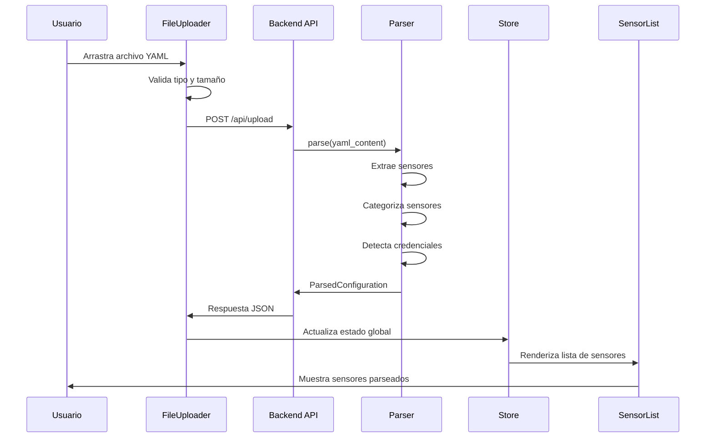
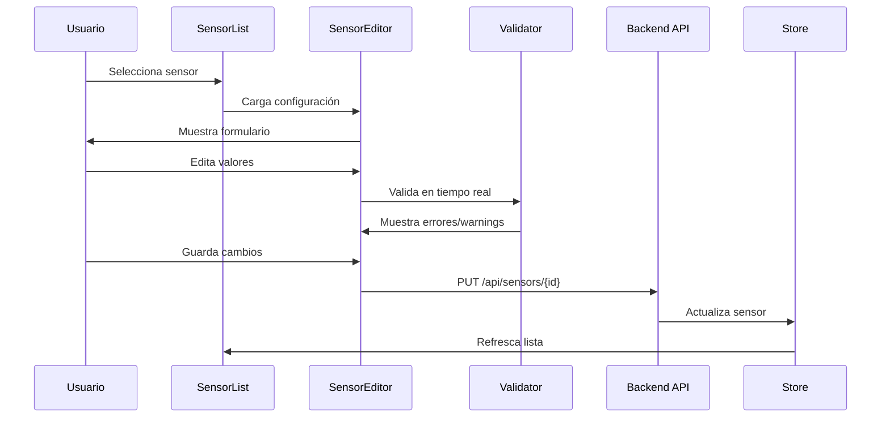

# Especificaciones Técnicas - Instana Config Pilot

## 📋 Índice

1. [Modelos de Datos](#modelos-de-datos)
2. [API Endpoints](#api-endpoints)
3. [Lógica de Negocio](#lógica-de-negocio)
4. [Componentes Frontend](#componentes-frontend)
5. [Flujos de Datos](#flujos-de-datos)
6. [Ejemplos de Código](#ejemplos-de-código)

---

## 1. Modelos de Datos

### 1.1 Backend - Pydantic Models

#### Sensor Model
```python
# backend/app/models/sensor.py
from typing import Dict, Any, Optional, List
from pydantic import BaseModel, Field
from enum import Enum

class SensorCategory(str, Enum):
    CLOUD_AWS = "cloud_aws"
    CLOUD_AZURE = "cloud_azure"
    CLOUD_GCP = "cloud_gcp"
    DATABASE = "database"
    MESSAGING = "messaging"
    APPLICATION_SERVER = "application_server"
    MONITORING = "monitoring"
    CONTAINER = "container"
    TRACING = "tracing"
    OTHER = "other"

class SensorConfig(BaseModel):
    enabled: Optional[bool] = True
    poll_rate: Optional[int] = Field(None, ge=1, le=3600)
    tags: Optional[List[str]] = None
    additional_config: Dict[str, Any] = Field(default_factory=dict)

class Sensor(BaseModel):
    id: str = Field(..., description="Unique sensor identifier")
    name: str = Field(..., description="Sensor name (e.g., com.instana.plugin.mysql)")
    display_name: str = Field(..., description="Human-readable name")
    category: SensorCategory
    enabled: bool = True
    config: Dict[str, Any] = Field(default_factory=dict)
    description: Optional[str] = None
    requires_credentials: bool = False
    env_variables: List[str] = Field(default_factory=list)

class SensorUpdate(BaseModel):
    enabled: Optional[bool] = None
    config: Optional[Dict[str, Any]] = None

class ParsedConfiguration(BaseModel):
    sensors: List[Sensor]
    total_sensors: int
    enabled_sensors: int
    categories: Dict[str, int]
    has_vault_integration: bool = False
```

#### Validation Models
```python
# backend/app/models/validation.py
from typing import List, Optional
from pydantic import BaseModel
from enum import Enum

class ValidationLevel(str, Enum):
    ERROR = "error"
    WARNING = "warning"
    INFO = "info"

class ValidationIssue(BaseModel):
    level: ValidationLevel
    field: str
    message: str
    suggestion: Optional[str] = None

class ValidationResult(BaseModel):
    is_valid: bool
    issues: List[ValidationIssue] = Field(default_factory=list)
    sensor_id: str
    
    @property
    def has_errors(self) -> bool:
        return any(issue.level == ValidationLevel.ERROR for issue in self.issues)
    
    @property
    def has_warnings(self) -> bool:
        return any(issue.level == ValidationLevel.WARNING for issue in self.issues)
```

#### Comparison Models
```python
# backend/app/models/comparison.py
from typing import List, Dict, Any
from pydantic import BaseModel
from enum import Enum

class ChangeType(str, Enum):
    ADDED = "added"
    REMOVED = "removed"
    MODIFIED = "modified"
    UNCHANGED = "unchanged"

class SensorDiff(BaseModel):
    sensor_id: str
    change_type: ChangeType
    original_config: Optional[Dict[str, Any]] = None
    modified_config: Optional[Dict[str, Any]] = None
    field_changes: Dict[str, Any] = Field(default_factory=dict)

class DiffStats(BaseModel):
    total_sensors: int
    added: int
    removed: int
    modified: int
    unchanged: int

class ComparisonResult(BaseModel):
    added_sensors: List[str]
    removed_sensors: List[str]
    modified_sensors: List[SensorDiff]
    stats: DiffStats
    diff_text: str  # Unified diff format
```

### 1.2 Frontend - TypeScript Types

```typescript
// frontend/src/types/instana.ts

export enum SensorCategory {
  CLOUD_AWS = 'cloud_aws',
  CLOUD_AZURE = 'cloud_azure',
  CLOUD_GCP = 'cloud_gcp',
  DATABASE = 'database',
  MESSAGING = 'messaging',
  APPLICATION_SERVER = 'application_server',
  MONITORING = 'monitoring',
  CONTAINER = 'container',
  TRACING = 'tracing',
  OTHER = 'other'
}

export interface SensorConfig {
  enabled?: boolean;
  poll_rate?: number;
  tags?: string[];
  [key: string]: any;
}

export interface Sensor {
  id: string;
  name: string;
  display_name: string;
  category: SensorCategory;
  enabled: boolean;
  config: SensorConfig;
  description?: string;
  requires_credentials: boolean;
  env_variables: string[];
}

export interface ParsedConfiguration {
  sensors: Sensor[];
  total_sensors: number;
  enabled_sensors: number;
  categories: Record<string, number>;
  has_vault_integration: boolean;
}

export enum ValidationLevel {
  ERROR = 'error',
  WARNING = 'warning',
  INFO = 'info'
}

export interface ValidationIssue {
  level: ValidationLevel;
  field: string;
  message: string;
  suggestion?: string;
}

export interface ValidationResult {
  is_valid: boolean;
  issues: ValidationIssue[];
  sensor_id: string;
}

export enum ChangeType {
  ADDED = 'added',
  REMOVED = 'removed',
  MODIFIED = 'modified',
  UNCHANGED = 'unchanged'
}

export interface SensorDiff {
  sensor_id: string;
  change_type: ChangeType;
  original_config?: SensorConfig;
  modified_config?: SensorConfig;
  field_changes: Record<string, any>;
}

export interface DiffStats {
  total_sensors: number;
  added: number;
  removed: number;
  modified: number;
  unchanged: number;
}

export interface ComparisonResult {
  added_sensors: string[];
  removed_sensors: string[];
  modified_sensors: SensorDiff[];
  stats: DiffStats;
  diff_text: string;
}
```

---

## 2. API Endpoints

### 2.1 Upload Endpoints

```python
# backend/app/routers/upload.py
from fastapi import APIRouter, UploadFile, File, HTTPException
from app.models.sensor import ParsedConfiguration
from app.services.parser import YAMLParser

router = APIRouter(prefix="/api/upload", tags=["upload"])

@router.post("/", response_model=ParsedConfiguration)
async def upload_yaml_file(file: UploadFile = File(...)):
    """
    Upload and parse a configuration.yaml file.
    
    Returns:
        ParsedConfiguration with all sensors and metadata
    """
    if not file.filename.endswith(('.yaml', '.yml')):
        raise HTTPException(400, "Only YAML files are allowed")
    
    content = await file.read()
    try:
        parser = YAMLParser()
        result = parser.parse(content.decode('utf-8'))
        return result
    except Exception as e:
        raise HTTPException(400, f"Failed to parse YAML: {str(e)}")

@router.post("/validate")
async def validate_yaml_file(file: UploadFile = File(...)):
    """
    Validate a configuration.yaml file without parsing.
    
    Returns:
        Validation result with any issues found
    """
    # Implementation
    pass
```

### 2.2 Sensor Endpoints

```python
# backend/app/routers/sensors.py
from fastapi import APIRouter, HTTPException
from typing import List
from app.models.sensor import Sensor, SensorUpdate
from app.models.validation import ValidationResult
from app.services.validator import SensorValidator

router = APIRouter(prefix="/api/sensors", tags=["sensors"])

@router.get("/", response_model=List[Sensor])
async def get_all_sensors():
    """Get all parsed sensors from current session"""
    # Implementation with session management
    pass

@router.get("/{sensor_id}", response_model=Sensor)
async def get_sensor(sensor_id: str):
    """Get specific sensor by ID"""
    # Implementation
    pass

@router.put("/{sensor_id}", response_model=Sensor)
async def update_sensor(sensor_id: str, update: SensorUpdate):
    """Update sensor configuration"""
    # Implementation
    pass

@router.post("/validate/{sensor_id}", response_model=ValidationResult)
async def validate_sensor(sensor_id: str):
    """Validate specific sensor configuration"""
    validator = SensorValidator()
    result = validator.validate_sensor(sensor_id)
    return result

@router.get("/category/{category}", response_model=List[Sensor])
async def get_sensors_by_category(category: str):
    """Get all sensors in a specific category"""
    # Implementation
    pass
```

### 2.3 Compare Endpoints

```python
# backend/app/routers/compare.py
from fastapi import APIRouter, UploadFile, File
from app.models.comparison import ComparisonResult
from app.services.comparator import YAMLComparator

router = APIRouter(prefix="/api/compare", tags=["compare"])

@router.post("/", response_model=ComparisonResult)
async def compare_yaml_files(
    original: UploadFile = File(...),
    modified: UploadFile = File(...)
):
    """
    Compare two configuration.yaml files.
    
    Returns:
        Detailed comparison with added, removed, and modified sensors
    """
    original_content = (await original.read()).decode('utf-8')
    modified_content = (await modified.read()).decode('utf-8')
    
    comparator = YAMLComparator()
    result = comparator.compare(original_content, modified_content)
    return result
```

### 2.4 Generate Endpoints

```python
# backend/app/routers/generate.py
from fastapi import APIRouter, Response
from fastapi.responses import StreamingResponse
from typing import List
from app.models.sensor import Sensor
from app.services.yaml_generator import YAMLGenerator
from app.services.env_generator import EnvGenerator
import io
import zipfile

router = APIRouter(prefix="/api/generate", tags=["generate"])

@router.post("/yaml")
async def generate_yaml(sensors: List[Sensor]):
    """Generate configuration.yaml from sensors"""
    generator = YAMLGenerator()
    yaml_content = generator.generate(sensors)
    
    return Response(
        content=yaml_content,
        media_type="application/x-yaml",
        headers={
            "Content-Disposition": "attachment; filename=configuration.yaml"
        }
    )

@router.post("/env")
async def generate_env(sensors: List[Sensor]):
    """Generate .env file from sensors"""
    generator = EnvGenerator()
    env_content = generator.generate(sensors)
    
    return Response(
        content=env_content,
        media_type="text/plain",
        headers={
            "Content-Disposition": "attachment; filename=.env.example"
        }
    )

@router.post("/bundle")
async def generate_bundle(sensors: List[Sensor]):
    """Generate ZIP bundle with both YAML and .env files"""
    yaml_gen = YAMLGenerator()
    env_gen = EnvGenerator()
    
    yaml_content = yaml_gen.generate(sensors)
    env_content = env_gen.generate(sensors)
    
    # Create ZIP in memory
    zip_buffer = io.BytesIO()
    with zipfile.ZipFile(zip_buffer, 'w', zipfile.ZIP_DEFLATED) as zip_file:
        zip_file.writestr('configuration.yaml', yaml_content)
        zip_file.writestr('.env.example', env_content)
    
    zip_buffer.seek(0)
    
    return StreamingResponse(
        zip_buffer,
        media_type="application/zip",
        headers={
            "Content-Disposition": "attachment; filename=instana-config.zip"
        }
    )
```

---

## 3. Lógica de Negocio

### 3.1 YAML Parser

```python
# backend/app/services/parser.py
import yaml
import re
from typing import Dict, List, Any
from app.models.sensor import Sensor, ParsedConfiguration, SensorCategory

class YAMLParser:
    """Parse Instana configuration.yaml files"""
    
    SENSOR_PATTERN = re.compile(r'^com\.instana\.(plugin|configuration)\.[\w.]+$')
    
    def parse(self, yaml_content: str) -> ParsedConfiguration:
        """Parse YAML content and extract sensors"""
        try:
            data = yaml.safe_load(yaml_content)
        except yaml.YAMLError as e:
            raise ValueError(f"Invalid YAML: {str(e)}")
        
        sensors = self._extract_sensors(data, yaml_content)
        
        return ParsedConfiguration(
            sensors=sensors,
            total_sensors=len(sensors),
            enabled_sensors=sum(1 for s in sensors if s.enabled),
            categories=self._count_categories(sensors),
            has_vault_integration=self._check_vault_integration(data)
        )
    
    def _extract_sensors(self, data: Dict, raw_content: str) -> List[Sensor]:
        """Extract all sensors from parsed YAML"""
        sensors = []
        
        for key, value in data.items():
            if self.SENSOR_PATTERN.match(key):
                sensor = self._create_sensor(key, value, raw_content)
                sensors.append(sensor)
        
        return sorted(sensors, key=lambda s: s.name)
    
    def _create_sensor(self, name: str, config: Any, raw_content: str) -> Sensor:
        """Create Sensor object from YAML data"""
        if config is None:
            config = {}
        
        # Extract description from comments
        description = self._extract_description(name, raw_content)
        
        # Determine category
        category = self._categorize_sensor(name)
        
        # Check if requires credentials
        requires_creds = self._requires_credentials(config)
        
        # Extract environment variables
        env_vars = self._extract_env_variables(name, config)
        
        return Sensor(
            id=self._generate_id(name),
            name=name,
            display_name=self._format_display_name(name),
            category=category,
            enabled=config.get('enabled', False) if isinstance(config, dict) else False,
            config=config if isinstance(config, dict) else {},
            description=description,
            requires_credentials=requires_creds,
            env_variables=env_vars
        )
    
    def _categorize_sensor(self, name: str) -> SensorCategory:
        """Determine sensor category from name"""
        if 'aws' in name:
            return SensorCategory.CLOUD_AWS
        elif 'azure' in name:
            return SensorCategory.CLOUD_AZURE
        elif 'gcp' in name:
            return SensorCategory.CLOUD_GCP
        elif any(db in name for db in ['mysql', 'postgres', 'mongodb', 'db2', 'oracle']):
            return SensorCategory.DATABASE
        elif any(msg in name for msg in ['kafka', 'rabbitmq', 'mq', 'activemq']):
            return SensorCategory.MESSAGING
        elif any(srv in name for srv in ['tomcat', 'jboss', 'weblogic', 'websphere']):
            return SensorCategory.APPLICATION_SERVER
        elif any(mon in name for mon in ['prometheus', 'datadog', 'dynatrace']):
            return SensorCategory.MONITORING
        elif any(cnt in name for cnt in ['docker', 'kubernetes', 'containerd']):
            return SensorCategory.CONTAINER
        elif 'trace' in name or 'profiling' in name:
            return SensorCategory.TRACING
        else:
            return SensorCategory.OTHER
    
    def _requires_credentials(self, config: Dict) -> bool:
        """Check if sensor configuration requires credentials"""
        if not isinstance(config, dict):
            return False
        
        credential_fields = ['password', 'token', 'api_key', 'secret', 'access_token']
        return any(field in str(config).lower() for field in credential_fields)
    
    def _extract_env_variables(self, name: str, config: Dict) -> List[str]:
        """Extract potential environment variable names"""
        if not isinstance(config, dict):
            return []
        
        env_vars = []
        sensitive_fields = ['password', 'token', 'api_key', 'secret_key', 'access_token']
        
        for key, value in config.items():
            if any(field in key.lower() for field in sensitive_fields):
                # Check if not using Vault
                if not (isinstance(value, dict) and 'configuration_from' in value):
                    var_name = f"{name.replace('.', '_').upper()}_{key.upper()}"
                    env_vars.append(var_name)
        
        return env_vars
    
    def _extract_description(self, name: str, raw_content: str) -> str:
        """Extract description from comments above sensor"""
        lines = raw_content.split('\n')
        description_lines = []
        
        for i, line in enumerate(lines):
            if name in line:
                # Look backwards for comments
                j = i - 1
                while j >= 0 and lines[j].strip().startswith('#'):
                    comment = lines[j].strip('#').strip()
                    if comment:
                        description_lines.insert(0, comment)
                    j -= 1
                break
        
        return ' '.join(description_lines) if description_lines else None
    
    def _format_display_name(self, name: str) -> str:
        """Format sensor name for display"""
        # com.instana.plugin.mysql -> MySQL
        parts = name.split('.')
        if len(parts) >= 4:
            sensor_name = parts[-1]
            return sensor_name.replace('_', ' ').title()
        return name
    
    def _generate_id(self, name: str) -> str:
        """Generate unique ID for sensor"""
        return name.replace('.', '_')
    
    def _count_categories(self, sensors: List[Sensor]) -> Dict[str, int]:
        """Count sensors by category"""
        counts = {}
        for sensor in sensors:
            category = sensor.category.value
            counts[category] = counts.get(category, 0) + 1
        return counts
    
    def _check_vault_integration(self, data: Dict) -> bool:
        """Check if Vault integration is configured"""
        return 'com.instana.configuration.integration.vault' in data
```

### 3.2 Validator

```python
# backend/app/services/validator.py
from typing import List, Dict, Any
from app.models.sensor import Sensor
from app.models.validation import ValidationResult, ValidationIssue, ValidationLevel

class SensorValidator:
    """Validate sensor configurations"""
    
    VALIDATION_RULES = {
        'poll_rate': {
            'type': int,
            'min': 1,
            'max': 3600,
            'message': 'poll_rate must be between 1 and 3600 seconds'
        },
        'enabled': {
            'type': bool,
            'message': 'enabled must be a boolean value'
        },
        'port': {
            'type': int,
            'min': 1,
            'max': 65535,
            'message': 'port must be between 1 and 65535'
        }
    }
    
    def validate_sensor(self, sensor: Sensor) -> ValidationResult:
        """Validate a sensor configuration"""
        issues = []
        
        # Validate common fields
        issues.extend(self._validate_common_fields(sensor))
        
        # Validate specific fields based on rules
        issues.extend(self._validate_config_fields(sensor.config))
        
        # Check for required credentials
        if sensor.requires_credentials:
            issues.extend(self._validate_credentials(sensor))
        
        # Check for best practices
        issues.extend(self._check_best_practices(sensor))
        
        return ValidationResult(
            is_valid=not any(i.level == ValidationLevel.ERROR for i in issues),
            issues=issues,
            sensor_id=sensor.id
        )
    
    def _validate_common_fields(self, sensor: Sensor) -> List[ValidationIssue]:
        """Validate common sensor fields"""
        issues = []
        
        if sensor.enabled and not sensor.config:
            issues.append(ValidationIssue(
                level=ValidationLevel.WARNING,
                field='config',
                message='Sensor is enabled but has no configuration',
                suggestion='Add configuration or disable the sensor'
            ))
        
        return issues
    
    def _validate_config_fields(self, config: Dict[str, Any]) -> List[ValidationIssue]:
        """Validate configuration fields against rules"""
        issues = []
        
        for field, value in config.items():
            if field in self.VALIDATION_RULES:
                rule = self.VALIDATION_RULES[field]
                
                # Type validation
                if not isinstance(value, rule['type']):
                    issues.append(ValidationIssue(
                        level=ValidationLevel.ERROR,
                        field=field,
                        message=rule['message']
                    ))
                    continue
                
                # Range validation for integers
                if rule['type'] == int and 'min' in rule and 'max' in rule:
                    if not (rule['min'] <= value <= rule['max']):
                        issues.append(ValidationIssue(
                            level=ValidationLevel.ERROR,
                            field=field,
                            message=rule['message']
                        ))
        
        return issues
    
    def _validate_credentials(self, sensor: Sensor) -> List[ValidationIssue]:
        """Validate credential configuration"""
        issues = []
        
        config = sensor.config
        has_vault = any(
            isinstance(v, dict) and 'configuration_from' in v 
            for v in config.values()
        )
        
        if not has_vault and sensor.env_variables:
            issues.append(ValidationIssue(
                level=ValidationLevel.INFO,
                field='credentials',
                message='Credentials should be externalized',
                suggestion='Consider using Vault or environment variables'
            ))
        
        return issues
    
    def _check_best_practices(self, sensor: Sensor) -> List[ValidationIssue]:
        """Check for best practices"""
        issues = []
        
        # Check poll_rate
        if 'poll_rate' in sensor.config:
            poll_rate = sensor.config['poll_rate']
            if poll_rate < 5:
                issues.append(ValidationIssue(
                    level=ValidationLevel.WARNING,
                    field='poll_rate',
                    message='Very low poll_rate may impact performance',
                    suggestion='Consider using poll_rate >= 5 seconds'
                ))
        
        # Check tags
        if sensor.enabled and 'tags' not in sensor.config:
            issues.append(ValidationIssue(
                level=ValidationLevel.INFO,
                field='tags',
                message='No tags configured',
                suggestion='Add tags for better organization'
            ))
        
        return issues
```

### 3.3 Environment Generator

```python
# backend/app/services/env_generator.py
from typing import List, Dict
from app.models.sensor import Sensor

class EnvGenerator:
    """Generate .env files from sensor configurations"""
    
    SENSITIVE_FIELDS = [
        'password', 'token', 'secret', 'api_key', 'apikey',
        'access_token', 'secret_key', 'client_secret',
        'access_key', 'secret_access_key', 'private_key'
    ]
    
    def generate(self, sensors: List[Sensor]) -> str:
        """Generate .env file content"""
        env_lines = [
            "# Generated by Instana Config Pilot",
            "# Environment variables for Instana configuration",
            "#",
            "# IMPORTANT: Fill in the values before using this file",
            "# Rename this file to .env after filling in the values",
            ""
        ]
        
        for sensor in sensors:
            if not sensor.enabled or not sensor.env_variables:
                continue
            
            env_lines.append(f"# Sensor: {sensor.display_name} ({sensor.name})")
            
            for env_var in sensor.env_variables:
                # Add comment with description if available
                field_name = env_var.split('_')[-1].lower()
                env_lines.append(f"{env_var}=")
            
            env_lines.append("")
        
        return '\n'.join(env_lines)
    
    def detect_env_variables(self, sensor: Sensor) -> List[str]:
        """Detect which fields should be environment variables"""
        env_vars = []
        
        if not isinstance(sensor.config, dict):
            return env_vars
        
        for key, value in sensor.config.items():
            # Skip if using Vault
            if isinstance(value, dict) and 'configuration_from' in value:
                continue
            
            # Check if field is sensitive
            if any(field in key.lower() for field in self.SENSITIVE_FIELDS):
                var_name = f"{sensor.name.replace('.', '_').upper()}_{key.upper()}"
                env_vars.append(var_name)
        
        return env_vars
```

---

## 4. Componentes Frontend

### 4.1 FileUploader Component

```typescript
// frontend/src/components/FileUploader/FileUploader.tsx
import React, { useCallback, useState } from 'react';
import { useDropzone } from 'react-dropzone';
import { Upload, FileText, AlertCircle } from 'lucide-react';
import { api } from '../../services/api';
import type { ParsedConfiguration } from '../../types/instana';

interface FileUploaderProps {
  onUploadSuccess: (config: ParsedConfiguration) => void;
}

export const FileUploader: React.FC<FileUploaderProps> = ({ onUploadSuccess }) => {
  const [uploading, setUploading] = useState(false);
  const [error, setError] = useState<string | null>(null);

  const onDrop = useCallback(async (acceptedFiles: File[]) => {
    const file = acceptedFiles[0];
    if (!file) return;

    setUploading(true);
    setError(null);

    try {
      const result = await api.upload(file);
      onUploadSuccess(result);
    } catch (err) {
      setError(err instanceof Error ? err.message : 'Upload failed');
    } finally {
      setUploading(false);
    }
  }, [onUploadSuccess]);

  const { getRootProps, getInputProps, isDragActive } = useDropzone({
    onDrop,
    accept: {
      'text/yaml': ['.yaml', '.yml']
    },
    maxFiles: 1,
    maxSize: 5 * 1024 * 1024 // 5MB
  });

  return (
    <div className="w-full max-w-2xl mx-auto p-6">
      <div
        {...getRootProps()}
        className={`
          border-2 border-dashed rounded-lg p-12 text-center cursor-pointer
          transition-colors duration-200
          ${isDragActive ? 'border-blue-500 bg-blue-50' : 'border-gray-300 hover:border-gray-400'}
          ${uploading ? 'opacity-50 cursor-not-allowed' : ''}
        `}
      >
        <input {...getInputProps()} disabled={uploading} />
        
        <div className="flex flex-col items-center gap-4">
          {uploading ? (
            <>
              <div className="animate-spin rounded-full h-12 w-12 border-b-2 border-blue-500" />
              <p className="text-gray-600">Uploading and parsing...</p>
            </>
          ) : (
            <>
              <Upload className="w-12 h-12 text-gray-400" />
              <div>
                <p className="text-lg font-medium text-gray-700">
                  {isDragActive ? 'Drop the file here' : 'Drag & drop your configuration.yaml'}
                </p>
                <p className="text-sm text-gray-500 mt-1">
                  or click to select file (max 5MB)
                </p>
              </div>
              <FileText className="w-8 h-8 text-gray-300" />
            </>
          )}
        </div>
      </div>

      {error && (
        <div className="mt-4 p-4 bg-red-50 border border-red-200 rounded-lg flex items-start gap-3">
          <AlertCircle className="w-5 h-5 text-red-500 flex-shrink-0 mt-0.5" />
          <div>
            <p className="font-medium text-red-800">Upload Error</p>
            <p className="text-sm text-red-600 mt-1">{error}</p>
          </div>
        </div>
      )}
    </div>
  );
};
```

### 4.2 SensorList Component

```typescript
// frontend/src/components/SensorList/SensorList.tsx
import React, { useState, useMemo } from 'react';
import { Search, Filter, ChevronRight } from 'lucide-react';
import type { Sensor, SensorCategory } from '../../types/instana';

interface SensorListProps {
  sensors: Sensor[];
  onSensorSelect: (sensor: Sensor) => void;
}

export const SensorList: React.FC<SensorListProps> = ({ sensors, onSensorSelect }) => {
  const [searchTerm, setSearchTerm] = useState('');
  const [selectedCategory, setSelectedCategory] = useState<SensorCategory | 'all'>('all');

  const categories = useMemo(() => {
    const cats = new Set(sensors.map(s => s.category));
    return Array.from(cats);
  }, [sensors]);

  const filteredSensors = useMemo(() => {
    return sensors.filter(sensor => {
      const matchesSearch = sensor.display_name.toLowerCase().includes(searchTerm.toLowerCase()) ||
                           sensor.name.toLowerCase().includes(searchTerm.toLowerCase());
      const matchesCategory = selectedCategory === 'all' || sensor.category === selectedCategory;
      return matchesSearch && matchesCategory;
    });
  }, [sensors, searchTerm, selectedCategory]);

  return (
    <div className="flex flex-col h-full">
      {/* Search and Filter */}
      <div className="p-4 border-b space-y-3">
        <div className="relative">
          <Search className="absolute left-3 top-1/2 transform -translate-y-1/2 w-5 h-5 text-gray-400" />
          <input
            type="text"
            placeholder="Search sensors..."
            value={searchTerm}
            onChange={(e) => setSearchTerm(e.target.value)}
            className="w-full pl-10 pr-4 py-2 border rounded-lg focus:ring-2 focus:ring-blue-500 focus:border-transparent"
          />
        </div>

        <div className="flex items-center gap-2">
          <Filter className="w-5 h-5 text-gray-400" />
          <select
            value={selectedCategory}
            onChange={(e) => setSelectedCategory(e.target.value as SensorCategory | 'all')}
            className="flex-1 px-3 py-2 border rounded-lg focus:ring-2 focus:ring-blue-500"
          >
            <option value="all">All Categories</option>
            {categories.map(cat => (
              <option key={cat} value={cat}>
                {cat.replace('_', ' ').toUpperCase()}
              </option>
            ))}
          </select>
        </div>
      </div>

      {/* Sensor List */}
      <div className="flex-1 overflow-y-auto">
        {filteredSensors.length === 0 ? (
          <div className="p-8 text-center text-gray-500">
            No sensors found matching your criteria
          </div>
        ) : (
          <div className="divide-y">
            {filteredSensors.map(sensor => (
              <button
                key={sensor.id}
                onClick={() => onSensorSelect(sensor)}
                className="w-full p-4 hover:bg-gray-50 transition-colors text-left flex items-center justify-between group"
              >
                <div className="flex-1">
                  <div className="flex items-center gap-2">
                    <h3 className="font-medium text-gray-900">{sensor.display_name}</h3>
                    <span className={`
                      px-2 py-0.5 text-xs rounded-full
                      ${sensor.enabled ? 'bg-green-100 text-green-800' : 'bg-gray-100 text-gray-600'}
                    `}>
                      {sensor.enabled ? 'Enabled' : 'Disabled'}
                    </span>
                  </div>
                  <p className="text-sm text-gray-500 mt-1">{sensor.name}</p>
                  {sensor.description && (
                    <p className="text-xs text-gray-400 mt-1 line-clamp-2">{sensor.description}</p>
                  )}
                </div>
                <ChevronRight className="w-5 h-5 text-gray-400 group-hover:text-gray-600" />
              </button>
            ))}
          </div>
        )}
      </div>

      {/* Stats */}
      <div className="p-4 border-t bg-gray-50">
        <div className="flex justify-between text-sm">
          <span className="text-gray-600">
            Showing {filteredSensors.length} of {sensors.length} sensors
          </span>
          <span className="text-gray-600">
            {sensors.filter(s => s.enabled).length} enabled
          </span>
        </div>
      </div>
    </div>
  );
};
```

---

## 5. Flujos de Datos

### 5.1 Flujo de Carga y Parseo



### 5.2 Flujo de Edición de Sensor



---

## 6. Ejemplos de Código

### 6.1 Ejemplo de Uso del Parser

```python
# Ejemplo de uso del parser
from app.services.parser import YAMLParser

yaml_content = """
# MySQL Database
com.instana.plugin.mysql:
  enabled: true
  poll_rate: 30
  user: 'root'
  password: 'secret123'
  host: 'localhost'
  port: 3306
  tags:
    - 'production'
    - 'database'

# MongoDB
com.instana.plugin.mongodb:
  enabled: false
  poll_rate: 60
"""

parser = YAMLParser()
result = parser.parse(yaml_content)

print(f"Total sensors: {result.total_sensors}")
print(f"Enabled sensors: {result.enabled_sensors}")

for sensor in result.sensors:
    print(f"- {sensor.display_name}: {'✓' if sensor.enabled else '✗'}")
    if sensor.env_variables:
        print(f"  Env vars: {', '.join(sensor.env_variables)}")
```

### 6.2 Ejemplo de Generación de .env

```python
# Ejemplo de generación de .env
from app.services.env_generator import EnvGenerator

# Asumiendo que tenemos sensores parseados
env_gen = EnvGenerator()
env_content = env_gen.generate(sensors)

print(env_content)
# Output:
# # Generated by Instana Config Pilot
# # Environment variables for Instana configuration
# 
# # Sensor: MySQL (com.instana.plugin.mysql)
# COM_INSTANA_PLUGIN_MYSQL_PASSWORD=
# 
# # Sensor: MongoDB (com.instana.plugin.mongodb)
# COM_INSTANA_PLUGIN_MONGODB_PASSWORD=
```

### 6.3 Ejemplo de Validación

```python
# Ejemplo de validación
from app.services.validator import SensorValidator

validator = SensorValidator()
result = validator.validate_sensor(mysql_sensor)

if not result.is_valid:
    print("Validation issues found:")
    for issue in result.issues:
        print(f"- {issue.level.upper()}: {issue.message}")
        if issue.suggestion:
            print(f"  Suggestion: {issue.suggestion}")
```

### 6.4 Ejemplo de Componente React

```typescript
// Ejemplo de uso del hook personalizado
import { useSensors } from '../hooks/useSensors';

export const Dashboard: React.FC = () => {
  const { sensors, loading, error, updateSensor } = useSensors();

  const handleToggleSensor = async (sensorId: string, enabled: boolean) => {
    try {
      await updateSensor(sensorId, { enabled });
    } catch (err) {
      console.error('Failed to update sensor:', err);
    }
  };

  if (loading) return <div>Loading...</div>;
  if (error) return <div>Error: {error}</div>;

  return (
    <div className="grid grid-cols-1 md:grid-cols-2 lg:grid-cols-3 gap-4">
      {sensors.map(sensor => (
        <SensorCard
          key={sensor.id}
          sensor={sensor}
          onToggle={(enabled) => handleToggleSensor(sensor.id, enabled)}
        />
      ))}
    </div>
  );
};
```

---

## 📝 Notas de Implementación

### Consideraciones de Performance

1. **Backend**:
   - Usar async/await para operaciones I/O
   - Implementar caching para parseo frecuente
   - Limitar tamaño de archivos (5MB max)

2. **Frontend**:
   - Lazy loading para listas grandes
   - Debounce en búsqueda
   - Virtualización para +1000 sensores

### Seguridad

1. **Validación de entrada**: Sanitizar todos los inputs
2. **CORS**: Configurar orígenes permitidos
3. **Rate limiting**: Prevenir abuso de API
4. **No logging de credenciales**: Filtrar logs sensibles

### Testing

1. **Unit tests**: Cada función pública
2. **Integration tests**: Flujos completos
3. **E2E tests**: Casos de uso principales
4. **Performance tests**: Archivos grandes

Esta especificación técnica proporciona la base detallada para implementar el proyecto Instana Config Pilot con todas las funcionalidades requeridas.